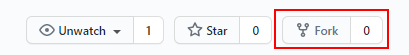
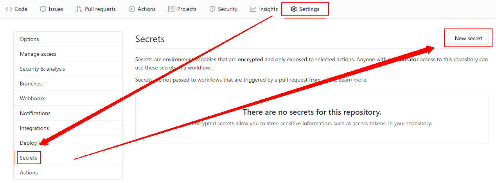
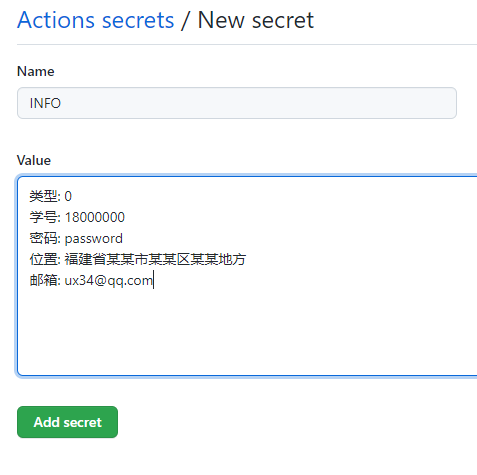
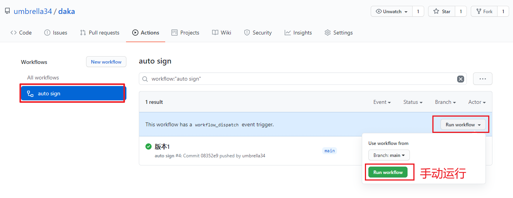
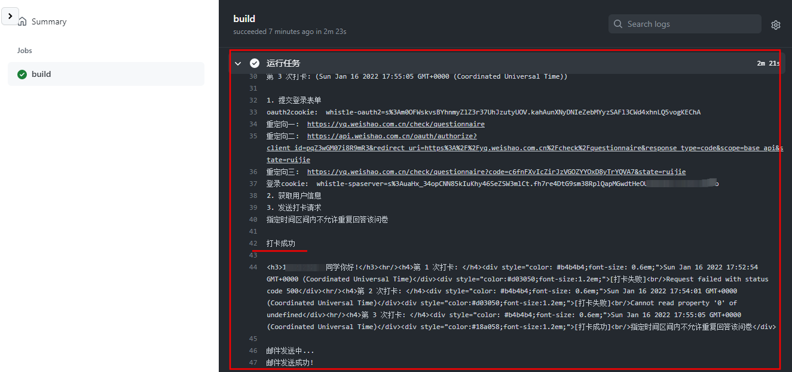
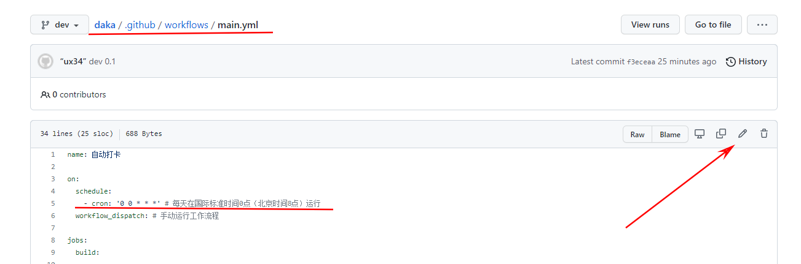

# ⏰ 定时

**小米运动步数更改**

## 🎮使用须知

使用前需要用户自行配置 Secrets，需要填写类型及微哨的学号、密码、位置。

*   用户名 **0**：

*   密码 **1**：

*   步数 **3**：最大值为99998
  
*   MAX **4**：0<x<99998
  
*   MIN **5**：0<x<99998

*   邮箱 **6**：选填

## 📐部署

> **如何更新：** 如果你不会使用git工具更新代码，建议直接删除该项目(`Setting` => `Delete this repository`)，然后重新部署一遍

1.  Fork 仓库

2.  添加信息 至 Secrets

3.  启用 Actions

### 1. Fork 仓库

*   项目地址：<https://github.com/hzxxqing/Step>

*   点击右上角 `Fork` 到自己的账号下

### 2. 添加 信息 至 Secrets

*   回到项目页面，依次点击 `Settings` --> `Secrets` --> `New secret`

<!--  -->

**请根据自身情况复制并修改对应的内容，也记得要及时更新内容哦**

### 3. 启用 Actions

> Actions 默认为关闭状态，Fork 之后需要手动执行一次，若成功运行其才会激活。

返回项目主页面，点击上方的 `Actions`，点击绿色按钮 `I understand my workflows, go ahead and enable them`.

进去后点击左边的 `auto sign`, 在点击 `enable workflow` 即可。

至此，部署完毕。

## 🔍结果

**部署完毕先手动运行一次, 看看运行结果, 才能确定填写信息是否正确**

<!--  -->

当你完成上述流程，可以在 `Actions` 页面点击 `auto sign` --> `build` --> `Run sign` 查看运行日志

<!--  -->

如果不能有正确的结果，请返回第二步，重新配置

## ✨更多

**设置定时时间：**

修改 `/.github/workflows/main.yml` 文件中的 `schedule - cron`

如 `'0 16 * * *'` 是每天在国际标准时间16点（北京时间凌晨0点）运行，你可以改成你需要的时间。

<!--  -->

**其他环境部署：**

在 `main.js` 文件中将上面配置的内容以字符串的形式给 `process.env['INFO']` 赋值即可，然后部署到自己的服务器（定时任务需要单独写）或云函数（云函数可以设置定时任务）